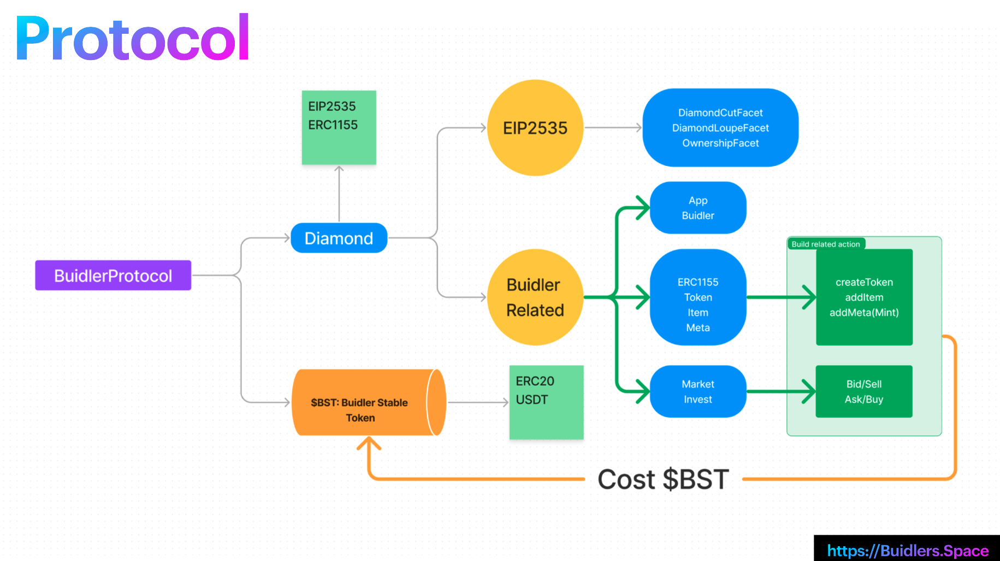
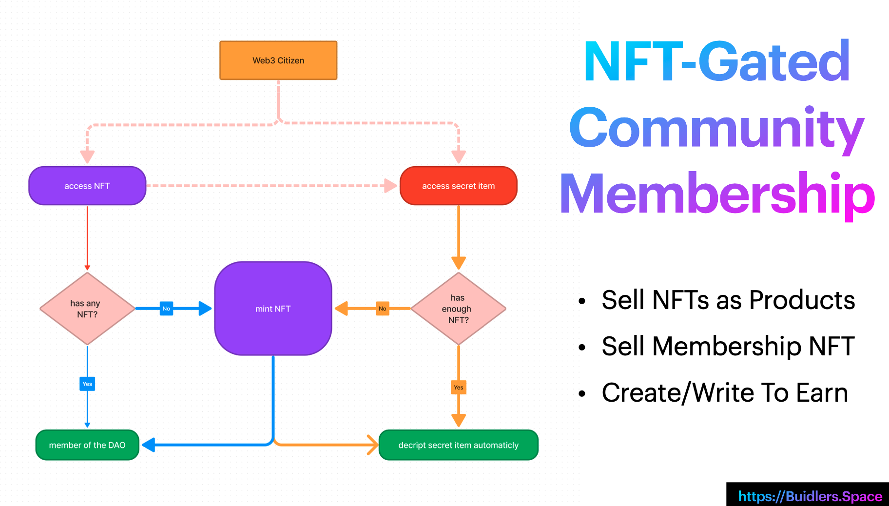

# Buiders.Space All in one web3 NFT space

The all-in-one web3 space for Creators & Brands with NFT create/mint/trade/token gating/De-Social features.

A multiple chain supported nft space that can create/trade/buy/bid/ask NFT stuff!

A web3 way of creater space that like a web3 amazon!

## Links

* Video Demo: <https://www.loom.com/share/da4b6b48d2a04d78ae62923ff6342cf0>
* Online demo
  * Mumbai
    * demo: <https://www.buidlers.space>
    * contract: <https://mumbai.polygonscan.com/address/0x3Efb3F8F64e8C62594Ff02866a07e63e576436Fd>
  * Fevm hyperspace
    * demo: <https://hyperspace.buidlers.space> (TBD)
    * contract: <https://hyperspace.filfox.info/en/address/0xfCB87c8BF0e9CDa86EEE939af64D6340F4562393>
  * Mantle
    * demo: <https://mantletestnet.buidlers.space/>
    * contract: <https://explorer.testnet.mantle.xyz/address/0xf495dD8D8B4e38bdcF811B39A19eb2b1f9E24686>
  * BSC Testnet
    * demo: <https://bsctestnet.buidlers.space/>
    * contract: <https://testnet.bscscan.com/address/0x268ab9c820c94c18ac8293e2e239bf0af1bd8f91>
* [All screenshots](./screenshot/)
* [Pitch Deck](./buidlers-space.pdf)

## Features

* We have the $BST(Buidler Stable Token) faucet not for user to test
* User can update their profile, check their social home page with Feed(get data from lens) / Creation / Bid order / Ask order
* On the KBL page, we can see the user list currently already add on to the chain
* Click on the user's avatar can get to the user's home page
* Creators/Producers can create an new ERC1155 NFT as their project
  * Also create a new Web3MQ chat group at the same time to bind on this NFT
* Creator can create new item for this NFT with token gating condition
* Consumers can mint NFT to access the token gating content with this NFT
* User can bid/ask of the NFT
* User can sell/buy order in the nft market

## Technologies I used

* EIP2535
* ERC1155
* Vue3
* Hardhat
* Multiple Chain support: Moonbean / Mantle / mumbai / bsc / fevm
* TailwindCSS
* WindiCSS
* PWA
* IPFS(nft.storage)
* Vercel
* QuickNode

## Challenges I ran into

While develop the `BuidlerProtocol` contract, it has so many function that it exceed the 24KB size limit.
Then we find out the greate `EIP2535` that help us to build unlimited size of our contract code.

## Have you validated the problem you are attacking and/or the solution?

We can see a lot of web2 brands try to involved into web3, that's why we believe it's time to push the market forward by us

## Polygon

we build an NFT ecosystem that help creators to create on polygon chain
contract deploy on: <https://mumbai.polygonscan.com/address/0x3Efb3F8F64e8C62594Ff02866a07e63e576436Fd>

## Mantle

We use mantle testnet and  deploy on <https://mantletestnet.buidlers.space/>
contract deploy on : <https://explorer.testnet.mantle.xyz/address/0xf495dD8D8B4e38bdcF811B39A19eb2b1f9E24686>

## SDK we use

### Web3MQ [code](https://github.com/NftTopBest/buiders-space-fevm-lighthouse/blob/main/frontend/stores/web3MQStore.ts)

## Problem

NFT should be have value on it not just PFP. We create the super great Smart Contract BuidlerProtocol that treat it as the central of the Builders! Every builders can create many build for themself for any project(every project is an NFT).

Builder will continue add new build on the NFT, so their users(buyer) can mint NFT(buy it with $NST), then can sell it or make an Ask order, and the guy do not mint the NFT can buy NFT from the de-market or just make a new Bid for the NFT.

While builder add new build for his/her NFT projects, they need to add the cidRaw and size, so later the SP can call activateDealBySP to activate the deal, then call the withdrawReward with cidRaw to get the reward.

* A lot of NFT list on OpenSea/X2Y2 with different contracts and data flow
* Users fall into lots of Ponzi projects without value
* Launch a DAO require a lot of complicate tech stuff to use for Web2 users
* There is no standard no-tech token gating solution for Web2 users yet

## Opportunity

Getting producers and consumers together all to web3 in a unified verse can help the productive economic more decentral
While taking a very tiny transaction friction fee can be incredibly profitable as more users join in

## Solution

NFT Revolution: Redefined what the NFT should be

* No Code DAO Creation
* Community Tokenized Building
* Membership NFT as a Gating
* Fit for every industry in the real world

### FEVM DataDAO

we use the FEVM Actor API in our smart contract to pay storage fee while builder add new item for their NFT build, and SP can activateDealBySP and withdrawReward. It depends the HyperActor from the @zondax/filecoin-solidity

addItem and pay $FIL to store deal: <https://github.com/NftTopBest/buiders-space-fevm-lighthouse/blob/main/contracts/Item.sol#L12>
DataDAO: <https://github.com/NftTopBest/buiders-space-fevm-lighthouse/blob/main/contracts/DataDAO.sol>

### lighthouse SDK

encrypted content with access conditions: <https://github.com/NftTopBest/buiders-space-fevm-lighthouse/blob/main/frontend/stores/mvStore.ts#L248>
decrypted content: <https://github.com/NftTopBest/buiders-space-fevm-lighthouse/blob/main/frontend/stores/mvStore.ts#L224>

### EIP2535 to build large contract <https://eips.ethereum.org/EIPS/eip-2535>

Our contract is large, so we use the Diamond Tech to build our smart contract: use the diamond cut func to deploy more facts: <https://github.com/NftTopBest/buiders-space-fevm-lighthouse/blob/main/contracts/DiamondCutFacet.sol>
